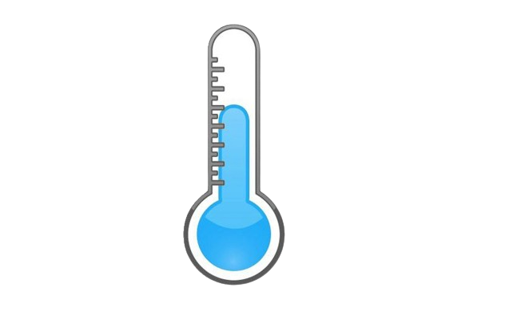

The Shecodes Vanilla Weather App Project.
This project includes html,css, basic Javascrpt and API Aintegration of a weather API from SheCodes

.humid > ul > li > img,
.feels > ul > li > img {
max-width: 50px;
max-height: 50px;
padding: 10px;
display: block;
margin: 0 auto;
}

<ul>
<li>

</li>
<li class="humidvalue">45&deg;C</li>
</ul>

           

            <ul>
              <li>
                
              </li>
              <li>67&deg;C</li>
            </ul>
          

